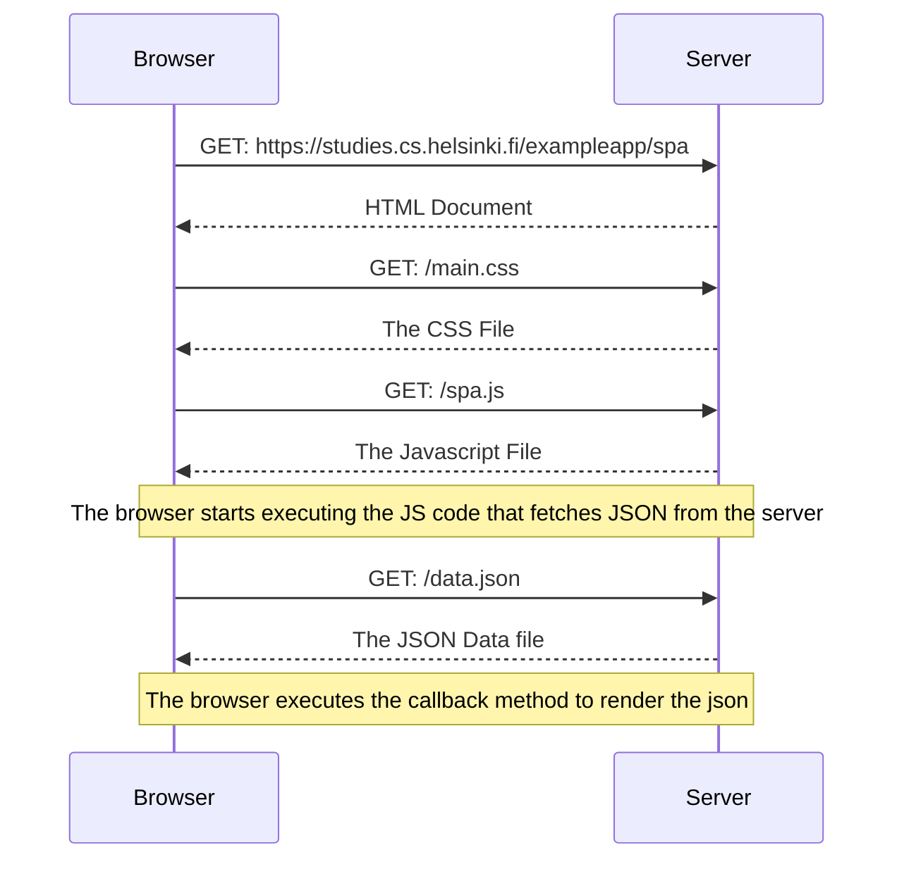

```mermaid
sequenceDiagram
Browser->>Server: GET: https://studies.cs.helsinki.fi/exampleapp/spa;
Server-->>Browser: HTML Document

Browser->>Server: GET: /main.css;
Server-->>Browser: The CSS File

Browser->>Server: GET: /spa.js;
Server-->>Browser: The Javascript File
Note over Browser, Server: The browser starts executing the JS code that fetches JSON from the server

Browser->>Server: GET: /data.json;
Server-->>Browser: The JSON Data file
Note over Browser, Server: The browser executes the callback method to render the json
```
